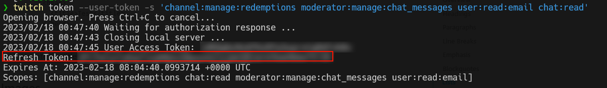

# Role Reward

Role Reward is a tool developed in Node.js that allows you to create advanced rewards for Twitch.

*Table of Contents:*

- [Role Reward](#role-reward)
  - [Features](#features)
  - [Setup](#setup)
    - [Requirements](#requirements)
    - [Guide](#guide)
  - [Configuration](#configuration)
    - [CLI Login](#cli-login)
    - [Web Login](#web-login)
  - [CLI Commands](#cli-commands)
    - [Commands](#commands)
  - [Api Routes](#api-routes)
    - [Auth Endpoint](#auth-endpoint)
    - [Channel Endpoint](#channel-endpoint)
    - [Discord Endpoint](#discord-endpoint)
    - [Home Endpoint](#home-endpoint)

## Features

- Create an custom reward on twitch and link that to an action.
- Supports discord role reward. (Apply a discord role to an user).
- Supports Fetch Reward. (Request to an url with custom data).
- Have an API REST.

## Setup

### Requirements

- [Node.js 18.14.1](https://nodejs.org)
- [Twitch Developers Account](https://dev.twitch.tv/)
> The twitch app must have authorized urls `http://localhost:4000` and `http://localhost:4000/auth/oauth`.
- [Discord Application](https://discord.com/developers)

### Guide

Frist clone this repository.

```bash
$ git clone https://github.com/VeguiDev/role-reward.git
```

Next goto the `role-reward` folder and execute this command. To install all packages.

```bash
$ npm install
```

Next create an `.env` file with this information.

*Example*:

```plain
CLIENT_ID=(GET IT FROM TWITCH DEV CONSOLE)
CLIENT_SECRET=(GET IT FROM TWITCH DEV CONSOLE)
DISCORD_BOT_TOKEN=(GET IT FROM DISCORD DEVELOPER PORTAL)
DISCORD_CLIENT_ID=(GET IT FROM DISCORD DEVELOPER PORTAL)
DISCORD_GUILD_ID=(IT'S THE GUILD YOU WANT TO GIVE THE REWARDS TO)
```

Next step is build the project.

```bash
$ npm run build
```

And last step is launch the application.

```bash
$ npm run dist
```

## Configuration
 
To start using this tool you need to login with twitch to do this there are two ways [CLI login](#cli-login) or [Web Login](#web-login)

### CLI Login

To login with this way you need have installed Twitch CLI.

This way is to get a refresh token with the twitch CLI and use it here.

```bash
$ twitch token --user-token -s "<NEED SCOPES>"
```

> To find out which scopes you need, use the scopes command.

*Exmaple of twitch CLI:*



Next copy this token to this application.


### Web Login

In this way, a session is started by accessing a web page.

Open browser an goto `http://localhost:4000/auth/authorize`. This page will be redirect to twitch.

## CLI Commands

The CLI is one that is within the same application to use it you must execute it.

### Commands

- Login: Used to login from terminal.
- Action <create|list|get>
  - `create`: Starts the setup of a new action.
  - `list or ls`: List all actions.
  - `get id`: Get an action with their id.
- Disconnect: Disconnects discord and twitch.
- Reconnect: Reconnect discord and twitch.
- Status: Get the status of the application.
- Logout: Close the current session.

## Api Routes

### Auth Endpoint

**GET** */auth*

Returns valid credentials.

**GET** */auth/authorize*

Redirects to twitch for oauth login.

**DELETE** */auth/logout*

Close the current session.

### Channel Endpoint

**GET** */channel/rewards*

List all channel custom rewards.

**GET** */channel/rewards/:id*

Get an channel custom reward.

**GET** */channel/rewards/:id/redemptions*

Get redemptions of a custom reward.

### Discord Endpoint

**GET** */discord/bot*

Create an invite link for the discord bot.

**GET** */discord/roles*

Get all roles of the discord guild configured.

**GET** */discord/roles/:id*

Get an role from discord guild configured.

### Home Endpoint

**GET** */actions*

List all registered actions.

**POST** */actions*

Create a new action.

*Body:*

```json
{
    "action_trigger": {
        "title": "Points Reward",
        "cost": 1
    },
    "reward": {
        "type": "DISCORD_ROLE",
        "roles": ["ROLE ID"]
    }
}
```

**GET** */status*

Get the current application status.

> Remember that the REST API is insecure and should not be exposed to the internet.